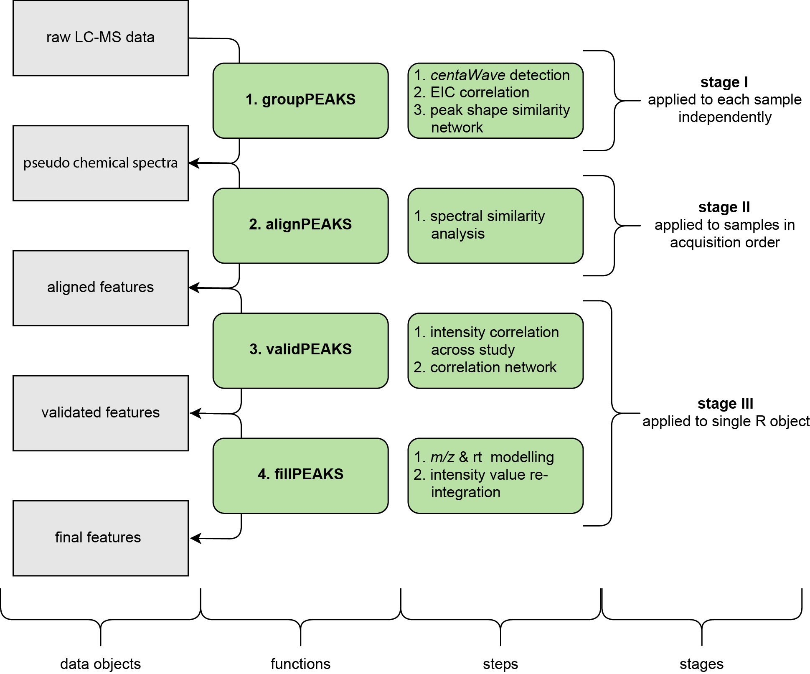

<style>
pre code, pre, code {
  white-space: pre !important;
  overflow-x: scroll !important;
  word-break: keep-all !important;
  word-wrap: initial !important;
}
</style>

**Package**: [massFlowR](https://github.com/lauzikaite/massFlowR)<br />
**Authors**: Elzbieta Lauzikaite<br />
**Date**: `r date()`

```{r  setup, echo = FALSE, results = "asis" }
BiocStyle::markdown() 
knitr::opts_chunk$set(
  collapse = TRUE,
  comment = "#>"
)
Biocpkg <- function (pkg) {
    sprintf("[%s](http://bioconductor.org/packages/%s)", pkg, pkg)
}
## supressing progress bar
options(kpb.suppress_noninteractive = TRUE) 
```

```{r libraries, message = FALSE, echo = FALSE}
## load libraries quietly to avoid printing messages in the vignette
suppressWarnings(library(massFlowR))
out_directory <- getwd()
url_p <- "https://htmlpreview.github.io/?https://github.com/lauzikaite/massFlowR/blob/master/doc/processing.html"
url_a <- "https://htmlpreview.github.io/?https://github.com/lauzikaite/massFlowR/blob/master/doc/annotation.html"
```

# Overview

This documents provides an overview of the LC-MS data pre-processing with `massFlowR`.

`massFlowR` aligns and annotates structurally-related spectral peaks across LC-MS experiment samples. The pipeline consists of three stages:

* Processing of individual LC-MS samples
* Peak alignment across samples
* Post-alignment processing

***

```{r, out.width = "700px", echo = FALSE}

```


# Peak annotation

If in-house chemical reference database is available, feature table generated by the pipeline can be automatically annotated. For more details how to build a database file, see [annotation using database](`r url_a`)).

# See also

* [Data processing](`r url_p`)
* [Automatic peak annotation](`r url_a`)
